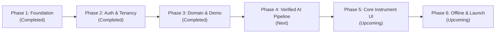

# Kinetra

> **High-Integrity, Evidence-Grounded Fitness Web Platform**  
> Turning personal context into verified nutrition and training plans with zero-tolerance for AI hallucinations.

Kinetra is a fitness web application that combines personalized nutrition and workout planning, daily telemetry tracking, offline logging, and measurable AI reliability.

Rather than treating Large Language Models as unverified authorities that hallucinate arbitrary diets or dangerous lifting volumes, Kinetra operates on a **Verification-First** architecture: pure peer-reviewed sports science rules (Mifflin-St Jeor, PAL multipliers, Morton et al. protein targets, US Navy circumference models) act as deterministic mathematical guardrails. AI acts solely as a structured plan generator, and its outputs must pass strict schema validation and domain verification before being presented to the user.

---

## Current Status: Phase 3 Implemented Locally

The repository is currently at **Phase 3 ("Domain contracts and an early synthetic demo")**.

- **Zero-Config Synthetic Demo**: Boots instantly in-memory without cloud accounts, database instances, or paid AI API keys.
- **Pure Scientific Calculations**: 100% deterministic algorithms for BMR, TDEE, safe caloric bounds, macronutrient distributions, and body composition.
- **Standardized Catalogs**: USDA FoodData Central ingredient provenance and exercise catalog with biomechanical metadata.
- **Two Complete Personas**: **Maya Lin** (58 kg, cut, pescatarian) and **Marcus Vance** (88 kg, bulk, omnivore/powerbuilding) with 14 days of realistic logs, 7-day meal plans, and multi-week resistance programs.
- **Interactive Web Interface**: 5 operational views (Today, Measure, Plan, Progress, and Foundation & Auth) with live persona switching and instant fixture resetting.
- **Quality Gates Passing**: Strict TypeScript, Biome linter/formatter, workspace dependency boundaries, and 38 unit/contract tests passing in CI.

*Note: Real-user collection and paid AI generation remain intentionally disabled at this phase. See the [Phase 3 Report](docs/PHASE_3_REPORT.md) and [Privacy Policy](PRIVACY.md).*

---

## Quick Start (Explore in 60 Seconds)

You can run the entire interactive demo locally with zero cloud dependencies or API keys:

### 1. Requirements
- Node.js `24.19.0` (or compatible Node 24 LTS)
- pnpm `11.19.0` (`npm install --global pnpm@11.19.0`)

### 2. Boot the Development Environment
```sh
# 1. Install dependencies
pnpm install --frozen-lockfile

# 2. Start the development server (API on 3001, Web on 5173)
pnpm dev
```

### 3. Open the App
Visit **[http://127.0.0.1:5173](http://127.0.0.1:5173)** in your browser.

---

## How to Look into the App

When you launch `http://127.0.0.1:5173`, you will see an instrument-grade dark UI. Here is how to explore its capabilities:

| Destination | What to Explore | What It Demonstrates |
| --- | --- | --- |
| **Persona Pills** (Header) | Click **Maya Lin (Cut)** or **Marcus Vance (Bulk)**, or click **Reset to pristine** | Instant state swap across all repositories; validates multi-persona fixtures and zero-bleed isolation. |
| **Today** | Review today's workout prompt, calorie gauge, and macro progress bars. Fill out the "Quick daily log" form at the bottom. | Real-time intake vs. target calculations; optimistic updates persisting across in-memory session. |
| **Measure** | Adjust demographic sliders, body weight, PAL activity level, and US Navy tape measurements. | Live Mifflin-St Jeor BMR, TDEE, macronutrient grams, and body-fat calculations with peer-reviewed literature citations. |
| **Plan** | Toggle between **Nutrition** (7-day pescatarian or omnivore schedules) and **Training** (4-day Upper/Lower or 5-day PPL programs). | Canonical plan schema rendering, meal timings, target macros, and structured progression sets/reps. |
| **Progress** | Inspect the 14-day weight trend bar chart, compliance KPI cards, raw daily log records, and completed workout sessions. | 14 days of realistic progression telemetry without gaps or synthetic anomalies. |
| **Foundation & Auth** | Test the typed tRPC health endpoint, Server-Sent Events (SSE) streaming cancellation, and optional local Supabase Auth panel. | The underlying Phase 1 & 2 transport layer and security infrastructure. |

---

## Codebase Tour

The repository is organized as a strict, clean pnpm monorepo:

```
kinetra/
├── apps/
│   ├── web/               # React 19 + Vite frontend (Tailwind/CSS tokens, TanStack Router/Query, Tab views)
│   └── api/               # Hono backend with typed tRPC routers, SSE streaming, and secure headers
├── packages/
│   ├── contracts/         # Canonical Zod schemas (Profile, Plans, Logs, Sessions, Coach streams, Repositories)
│   ├── domain/            # Pure sports science calculations, USDA/exercise catalogs, personas, demo repos
│   ├── db/                # Drizzle ORM schema models, migrations, and tenant isolation types
│   └── config/            # Shared ESLint/Biome, TS configs, and environment validation
├── docs/                  # Comprehensive engineering docs and audit trail
│   ├── ARCHITECTURE.md    # System architecture, data flow, security model, and decision records
│   ├── PROJECT_PLAN.md    # Multi-phase master completion plan and progress tracking
│   ├── WORKFLOW.md        # Engineering guidelines, testing protocols, and CI/CD rules
│   ├── PHASE_1_REPORT.md  # Phase 1 verification evidence
│   ├── PHASE_2_REPORT.md  # Phase 2 auth & tenant isolation verification evidence
│   └── PHASE_3_REPORT.md  # Phase 3 domain contracts & synthetic demo verification evidence
├── scripts/               # Boundary checking, security integration testing, auth seeding, and sanity checks
├── supabase/              # Local Supabase migrations, RLS policies, quota functions, and SQL seeds
├── tests/                 # Vitest test suites (domain.test.ts, foundation.test.ts, security.test.ts)
└── PRIVACY.md             # Privacy policy, data handling guarantees, and launch gates
```

---

## What Is Going to Happen (The Roadmap)

Kinetra is built according to a strict 6-phase engineering lifecycle:



### ✅ Phase 1: Monorepo Foundation & Toolchain (Complete)
- Strict TypeScript (`exactOptionalPropertyTypes`, `noUncheckedIndexedAccess`), Biome, Vitest.
- Hono API with typed tRPC procedures and SSE cancellation transport.
- Security headers (strict CSP, HSTS, anti-clickjacking) and zero-secret client bundle scans.

### ✅ Phase 2: Security, Auth & Tenant Isolation (Complete)
- Local Supabase Postgres stack with Row-Level Security (RLS) on all tenant tables.
- Constrained SQL write functions, atomic rate-limiting, and quota reservations.
- 40 passing SQL integration and authorization tests (`test:security`).

### ✅ Phase 3: Domain Contracts & Early Synthetic Demo (Complete)
- Canonical Zod contracts for all core entities: Profiles, Plans, Telemetry, Sessions, and Coach events.
- Pure sports science calculation library with academic grounding.
- Standardized USDA nutrition and exercise catalog with fallback resolution.
- Two complete synthetic personas with 14 days of realistic logs and structured plans.
- 5-destination web demo with zero cloud credentials required.

### ⏳ Phase 4: Deterministic Verification & AI Pipeline (Next Up)
- **Server-Side AI Pipeline**: Google Gemini integration isolated exclusively to backend procedures.
- **Deterministic Verification Engine**: Algorithms that inspect AI-generated meal and workout plans against hard nutritional constraints (calorie bounds, macro tolerances, dietary restrictions, equipment availability) before accepting them.
- **Bounded Retry Loop**: Automatic regeneration with structured error feedback if generated plans fail verification.
- **Real-Time Coach Streaming**: SSE endpoint delivering streaming coaching advice with citations and structured follow-up suggestions.

### ⏳ Phase 5: Core Instrument UI & Form Lab (Upcoming)
- **Production Instrument Interface**: High-density mobile-first ergonomics, micro-interactions, dark/light theme tokens.
- **Active Workout Session Logger**: Rest timers, RPE/RIR tracking, and superset support.
- **On-Device Form Lab**: Real-time rep counting and joint-angle analysis using client-side MediaPipe/TensorFlow. **No camera video or photos are ever sent to a remote server.**

### ⏳ Phase 6: Offline Sync, Privacy Lifecycle & Launch Readiness (Upcoming)
- **Offline First**: Dexie IndexedDB local queue with conflict-free background synchronization.
- **Privacy & Lifecycle Controls**: One-click GDPR/CCPA data export, cryptographic account purge, and quota monitoring.
- **Launch Gates Certification**: Performance audits (LCP < 1.2s, INP < 100ms), security penetration testing, and production deployment.

---

## Verification & Quality Commands

Every change to the repository must pass our non-mutating quality check:

```sh
# Run full static analysis, boundary check, typecheck, 38 tests, and build checks
pnpm check

# Run unit and contract tests in watch mode
pnpm test

# Run API smoke tests (requires API running on port 3001)
pnpm smoke
```

### Optional: Local Database & Security Suite
If you have Docker Desktop or OrbStack running, you can test the complete local database and security layer:

```sh
# Start local Supabase containers (Auth, Postgres, Studio)
pnpm db:start
pnpm db:migrate
pnpm db:seed

# Run the 40-assertion security and tenant-isolation test suite
pnpm test:security

# Stop local database containers
pnpm db:stop
```

---

## Key Documentation

- [docs/ARCHITECTURE.md](docs/ARCHITECTURE.md) - System topology, data models, state machine, and design patterns.
- [docs/PROJECT_PLAN.md](docs/PROJECT_PLAN.md) - Step-by-step deliverable checklist for all 6 phases.
- [docs/PHASE_3_REPORT.md](docs/PHASE_3_REPORT.md) - Full evidence and verification report for the current Phase 3 build.
- [docs/WORKFLOW.md](docs/WORKFLOW.md) - Git conventions, testing requirements, and coding standards.
- [PRIVACY.md](PRIVACY.md) - Data minimization guarantees and privacy policy.

