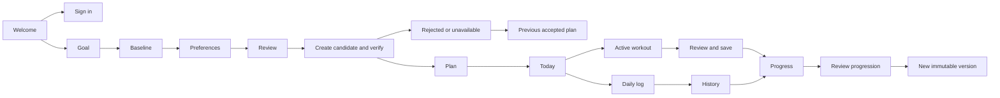
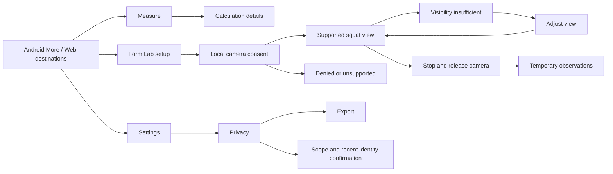
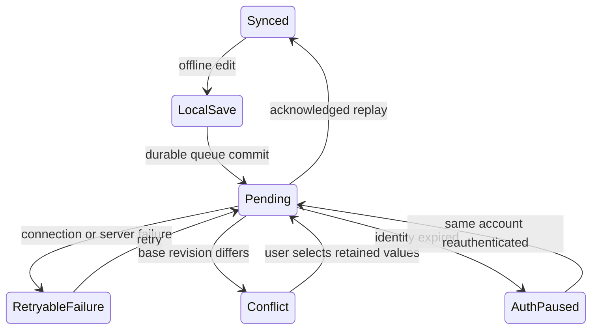

# Journeys and screen coverage

All listed screens have desktop web and Android concepts in light and dark. IDs resolve to `mockups/{platform}/{theme}/{id}.html` and `.png`. `screen-manifest.json` is the machine-readable source of truth.

## Product journeys

## Complete inventory

| Area | Screen IDs | Purpose |
| --- | --- | --- |
| Entry and authentication | welcome, signup, verify-email, signin, reset, reset-sent, new-password | Brand entry, account creation, email confirmation, sign in, password recovery and privacy-preserving sent confirmation |
| Onboarding | onboard-goal, onboard-body, onboard-preferences, onboard-review | Goal → equation inputs → dietary/equipment constraints → review and consent |
| Daily routine | today, daily-log, log-saved, voice | Next action, typed log, confirmed save, editable voice extraction |
| Nutrition and training plan | nutrition, meal, training, exercise | Plan tabs, weekly selector, ingredient provenance, movement guide and prescription |
| Training session | session, session-complete | Set/load/rep/RPE logging, rest timer, review before save |
| Measurement | measure, calculation | Baseline, energy assumptions, tape measurements, estimate provenance |
| Progress | progress, history, strength, progression, photos | Trends, records, completed session details, reviewed proposed change, optional photo consent |
| Coach | coach, coach-streaming | Bounded-context guidance, structured actions, response streaming and cancellation |
| Form Lab | form-setup, form-active, form-low, form-summary | Local consent, supported tracking, low-confidence pause, camera-off summary |
| Account | more, settings, appearance, reminders, privacy, export, delete-account | Android toolkit, profile, theme, timezone reminders, purpose-specific consent and data lifecycle |
| Resilience | sync, conflict, expired | Pending queue, local/server comparison, reauthentication without draft loss |
| Plan lifecycle | generating, generation-failed, plan-revision, versions, share | Verification stages, preserved plan on failure, explicit revision, immutable history, scoped expiring grant |
| Shared system states | empty, loading, error, validation, permission | New-account state, loading skeletons, connection retry, recoverable form errors, camera fallback |

## Additional state behavior for implementation

These are specified states of the represented screens, not additional backend capabilities:

- **Onboarding:** back preserves fields; invalid input uses the validation pattern; skipped equation inputs allow a profile without a calculated energy estimate. Verify eligibility and domain policy before real personalized guidance.
- **Daily logs:** initial draft, editing an existing day, local saved/pending, synced, conflict, failed write. Deletion confirmation names the day. Optional blanks remain absent, not zero.
- **Session:** active, paused, rest countdown, incomplete sets, abandoned draft, reviewed completion. Production timer uses elapsed timestamps and recovers from backgrounding.
- **Plan generation:** analyze inputs, request candidate, verify, retry within configured limits, accept; cancel or fail keeps the previous version. Rejected content is never exposed as accepted.
- **Coach:** initial question prompts, status phases, text deltas, citations, done, stopped/incomplete, interruption and retry. Keep text safe; duplicate requests must not silently spawn duplicate responses.
- **Form Lab:** permission request, model loading, supported active view, low confidence, device unsupported, denial, paused and ended. Stop camera processing when hidden or exited according to the platform lifecycle.
- **Exports:** preparing, ready, expired download, retryable failure. Show a truthful scope, file type, and completion timestamp.
- **Deletion:** confirm scope → verify identity → pending job → completed or retry. A partial job cannot show success. Preserve published backup and offline-device limitations.
- **Shares:** create scoped grant, copy link, revoke, expired/public unavailable. Recipient view contains only the selected plan version.
- **Photos:** off by default, consent, upload in progress, failed upload, private timeline, comparison, individual delete, withdrawal. No biometric conclusions.

## Scope traceability

| Design surface | Repository reference | Delivery status |
| --- | --- | --- |
| Six destinations | `docs/decisions/0004-scope-governance-and-domain-policy.md` | Frozen product scope |
| Today / Measure / Plan / Progress | `apps/web/src/features/` | Existing synthetic views; redesign concepts |
| Onboarding and forms | `packages/contracts/src/account.ts`, P5-02 | Future production UI |
| Plan provenance / versions | `packages/contracts/src/plans.ts`, P4 and P5-05 | Contracts exist; lifecycle UI concept |
| Active workout | `packages/contracts/src/sessions.ts`, P5-01 and README roadmap | Session schema exists; live logger concept |
| Coach states | `packages/contracts/src/coach.ts`, P9-01 | Stream schema exists; consumer UI concept |
| Voice extraction | `packages/contracts/src/voice.ts`, P9-02 | Schema exists; confirmation UI concept |
| Form Lab | P7-01–P7-07 | Future local squat analysis |
| Offline and conflicts | P6-01–P6-06 | Future durable queue UI |
| Export/deletion and consent | `PRIVACY.md`, P6-07–P6-09 | Release-gated future controls |
| Adaptive progression | P8-01–P8-05 | Future deterministic, reviewed proposals |
| Scoped sharing / photos | P9-03–P9-04 | Future optional features |

No third-party foundation API inspector is placed in consumer navigation. Development diagnostics can remain in an environment-gated route.
