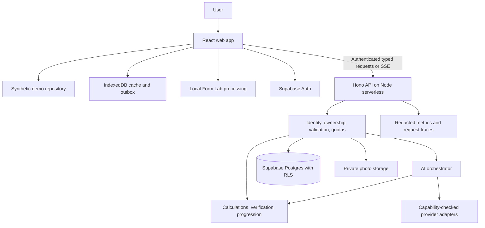

# Kinetra architecture

**Status:** proposed implementation baseline. **Baseline date:** 2026-10-01.

This document describes what Kinetra should become. The checkout currently contains documentation, not the implementation shown below. Historical reviews are useful design inputs, but their account of the previous app is not evidence about this repository's runtime behavior.

## 1. Goals and constraints

Build a fitness planning and tracking application with trustworthy generated plans, explainable progress feedback, an accessible mobile interface, and useful offline behavior. Keep the primary user journey coherent: profile → targets → verified plan → daily execution → recorded progress → reviewed adjustment.

Design constraints:

- Treat AI responses, imported data, URL parameters, and browser state as untrusted.
- Maintain one canonical schema per contract and runtime checks at trust boundaries.
- Keep deterministic domain rules independent of UI, providers, and database access.
- Store private user data with explicit ownership, retention, export, and deletion behavior.
- Make provider outages and network failures visible and recoverable.
- Prefer one deployable API and one web app over premature microservices.
- Keep demo journeys available without creating a public AI proxy.

Skincare, body-fat estimation from images, social leaderboards, wearable integrations, and a marketplace are outside v1. Nutrition label OCR, barcode logging, and a plate calculator are later candidates.

## 2. Current evidence and prior-system context

| Item | Evidence in this checkout |
| --- | --- |
| Product name | Repository and README use Kinetra |
| Planning inputs | Three review Markdown files at the root |
| Application source | Absent |
| Runtime, packages, tests, SQL, hosting configuration | Absent |
| Prior implementation | Described by the reviews as vanilla JS, Clerk, Supabase, and serverless AI functions; not independently verified here |

If the previous implementation is imported, first inventory it and reproduce its behavior. Convert historical findings into confirmed issues with reproduction cases. If it is unavailable, build the target architecture from a clean scaffold and treat migration-specific tasks as explicitly not applicable with an explanation.

## 3. Proposed system



The browser calls Auth for identity operations and the API for application records. Local inference does not require photo upload. A seeded demo repository implements the same read interfaces but never performs account writes or provider calls.

### Component ownership

| Component | Responsibilities | Must not do |
| --- | --- | --- |
| Web features | Forms, route state, accessible rendering, user feedback | Hold provider secrets or trust client ownership claims |
| Query/cache layer | Fetch, invalidate, optimistic updates, outbox reconciliation | Become the only persisted record of online data |
| Contracts package | Schemas, DTO types, protocol versions | Depend on UI or secret-bearing server modules |
| Domain package | Calculations, verification, progression, unit conversion | Call providers or mutate persistence |
| API middleware | Verify identity, authorize resources, validate inputs, enforce limits | Treat authentication alone as sufficient authorization |
| AI orchestrator | Select compatible provider, validate and verify, bound recovery | Render or save partial JSON as an accepted plan |
| Persistence layer | Transactions, tenant-scoped queries, migrations | Accept arbitrary profile state blobs |
| Form Lab | Landmarks, confidence filtering, rep state, local overlays | Claim medical measurement or persist camera frames implicitly |

## 4. Stack decisions and tradeoffs

Use React with strict TypeScript and Vite for a SPA. Use TanStack Router for addressable features, TanStack Query for server state, and local component state for transient input. Add Zustand only when a concrete cross-route UI requirement cannot be handled simply. Use React Hook Form and Zod for form contracts, and Tailwind with custom design tokens for consistent styling.

Use Hono on a **Node serverless runtime** initially. This avoids making edge compatibility an assumption for database libraries, AI SDKs, and streaming. Validate production SSE behavior, deployment duration limits, and request sizes before release. An edge move is a separate measured decision.

Use tRPC for typed application procedures and a dedicated SSE endpoint for coach text and generation status. Share schemas across both. A spike must verify the Hono/tRPC adapter and deployment behavior before locking the integration; if it fails, document a typed HTTP alternative before implementing features.

Use Supabase Auth, Postgres, and private Storage to consolidate identity and tenant data. Use Drizzle for versioned schema changes. If prior Clerk accounts exist, retain Clerk until a tested identity mapping and account migration path are approved; changing auth must not create orphaned records or force silent account recreation.

Use Dexie for IndexedDB and Workbox for service-worker lifecycle management. Start with Gemini as the primary provider candidate, then add one fallback only after capabilities and output quality are measured. Optional tooling such as Turborepo or a shared UI package is justified by actual reuse, not required at scaffold time.

The version numbers and provider comparisons in the historical reviews are not adopted as verified facts. Pin compatible versions at scaffold time and record supported models in configuration with a last-verified date.

## 5. Proposed repository layout

```text
apps/
  web/
    src/
      app/                 router, providers, layouts
      routes/              onboarding, today, measure, plan, coach, form-lab, progress
      features/            feature components, hooks, API bindings
      components/          accessible reusable UI primitives
      lib/offline/         account-scoped cache, outbox, sync coordination
      lib/camera/          permission and device lifecycle
      styles/              theme tokens and shared styles
    public/                manifest and install assets
  api/
    src/
      middleware/          auth, request limits, quotas, request IDs
      routers/             profile, logs, plans, privacy procedures
      routes/              SSE transport and operational endpoints
      services/            application orchestration
      ai/                  adapters, prompts, policy, recovery, budgets
      repositories/        tenant-scoped persistence
packages/
  contracts/               Zod DTOs and streaming event schemas
  domain/                  calculations, verifier, progression policies
  db/                      schema, migrations, RLS, database test helpers
  config/                  shared TypeScript and tooling configuration
tests/e2e/                 critical user journeys
evals/                     synthetic fixtures, runner, rubric, dated reports
docs/                      architecture, workflow, project plan, later decisions
```

This tree is a target, not an inventory. Contracts and domain packages must never import browser or server infrastructure. The API may import them; the web app may import their safe exports. Enforce dependency boundaries and prevent server credentials or repositories from entering browser bundles.

## 6. Data model and ownership

All account records use the verified auth subject as owner. Internal IDs are opaque and cannot substitute for ownership checks. Persist UTC timestamps alongside the profile's IANA timezone; a daily log also has an explicit local date. Do not reinterpret a past date merely because a user travels or changes timezone.

| Entity | Minimum proposed fields | Key invariant |
| --- | --- | --- |
| Profile | owner ID, unit preferences, timezone, validated biometrics, goal, preferences, consent version, revision, timestamps | Allow-listed fields only; no image bytes or client-written owner |
| Daily log | ID, owner ID, local date, timezone at entry, normalized metrics, revision, timestamps | Defined date granularity; owner/date uniqueness where appropriate |
| Training session | ID, owner ID, plan version, started/completed times, exercise sets, load unit, reps, effort | Link recorded work to its original prescription |
| Plan | ID, owner ID, kind, current version, lifecycle state, timestamps | Private by default; accepted versions immutable |
| Plan version | plan ID, version, validated payload, target snapshot, prompt/schema/policy versions, provenance | Reproduce why this plan was accepted |
| AI operation | owner ID, idempotency key, input digest, state, result reference, expires at | Same key plus same input returns one logical result |
| Photo metadata | owner ID, private object path, purpose, consent version, retention deadline | No permanent public URL; cleanup reconciles metadata and objects |
| Consent record | owner ID, purpose, version, action, timestamp | Separate camera use, storage, and provider processing consent |
| Share grant | plan version ID, hashed token, expiry, revocation, allowed fields | Expose only explicitly selected plan content |
| Usage bucket | owner ID, time window, request/token counts, expiry | Atomic consumption; scheduled cleanup |
| Deletion job | owner ID, state, completed steps, retry state, timestamps | Retryable cleanup across auth, DB, and storage |

Use foreign keys, unique constraints, `updated_at` rules, and tested migration order. Pinning a plan item should use an explicit editable preference or draft record; preserve immutable published versions and create a new version for changes.

RLS should enforce `auth.uid()` ownership for user-scoped access. The initial API should query application tables using a verified user's token so RLS remains a second boundary. Privileged service credentials are reserved for controlled administrative jobs; those jobs must scope operations explicitly because privileged credentials can bypass RLS. Test both API ownership enforcement and direct database access policies.

## 7. API and streaming contracts

Proposed operations:

| Area | Operations | Required behavior |
| --- | --- | --- |
| Profile | read, update | Allow-listed input, revision check, timezone and unit validation |
| Logs | list by date range, upsert, delete | Bounded pagination, idempotent writes, revision conflicts |
| Plans | request generation, list, read version, create revision, pin item | Ownership, immutable accepted versions, bounded generation |
| Coach | start stream, cancel | Auth, bounded context, SSE terminal state |
| Privacy | export, request deletion, deletion status | Recent authentication for destructive actions; resumable job |
| Photos | request upload permission, register, list, delete | Consent, byte/type limits, private object ownership |
| Sharing | create, revoke, resolve | Explicit disclosure, expiry, unguessable token |

Return a consistent error containing a stable code, safe message, request ID, and retryable flag. Examples include `UNAUTHENTICATED`, `FORBIDDEN`, `VALIDATION_FAILED`, `REVISION_CONFLICT`, `RATE_LIMITED`, `PROVIDER_UNAVAILABLE`, and `PLAN_REJECTED`. Do not expose credentials, SQL errors, stack traces, or raw rejected model responses.

Define SSE events such as `started`, `status`, `text_delta`, `validated_result`, `error`, and `done`, with an operation ID and protocol version. Client code must handle split chunks, cancellation, timeout, and missing terminal events. Coach text may stream as escaped text. Structured plan fragments may show progress but cannot become an accepted plan until validation and verification finish.

Apply authentication and method checks before provider calls. Unsupported requests must not consume AI quota. Enforce origin rules according to the deployment topology; cookie-based auth requires a documented CSRF defense, while cross-origin bearer transport requires a narrow allowed-origin policy. Enforce resource ownership regardless of origin.

## 8. AI generation and verification


Canonical Zod schemas provide application types and runtime validators. Generate provider-compatible schema representations from them and test adapters against any provider restrictions. Native structured output reduces format failures; it does not replace local validation. A short malicious string can pass a valid string schema: validation is **not** HTML sanitization.

Separate three dimensions of quality:

1. **Shape:** required fields, finite numbers, bounded strings and arrays, supported units.
2. **Deterministic constraints:** day/session counts, target totals, excluded ingredients, exercise/equipment compatibility, configured volume bounds, duplicates, and progression limits.
3. **Expert/subjective assessment:** realism, clarity, variety, and appropriateness. These require a published rubric and cannot be claimed solely from automated checks.

The reviews suggest ±8% calorie tolerance. Treat that as a candidate policy, not a clinical standard. Document configurable tolerances, calculation assumptions, nutrition-data provenance, and limitations before adopting them. Estimated food macros cannot prove medical safety or allergen absence. Hard ingredient exclusions require a normalized catalog and conservative handling of unknown or ambiguous ingredients. A pantry preference can be soft unless the user explicitly requests pantry-only planning.

Each generation gets a global deadline, maximum call count, token budget, and one semantic repair at most. Transport retries and provider fallback count toward the same operation budget. Retry only transient failures, respect retry hints, and apply jitter; fail fast for invalid input or identity problems. A circuit breaker prevents repeated calls to an unhealthy provider. Do not replay a partially streamed coach response on another provider without restarting the visible response explicitly.

Never accept an invalid fallback because it is deterministic. Run templates through the same schema and verifier; if none meets the user's constraints, show a clear failure and a useful next action. Record result provenance as generated, repaired, cached, or template-based.

Prompt injection mitigations include bounded user fields, explicit separation of instructions and data, minimal context, no secrets in prompts, and adversarial evaluations. Delimiters alone do not guarantee resistance. Provider output cannot authorize data access or execute tools.

## 9. Offline behavior and conflict resolution

Cache the app shell and explicitly selected read models. Never cache authenticated API responses indiscriminately in the service worker. Partition IndexedDB by account, clear it on logout, and block replay if the currently authenticated owner differs from the queued owner.

A queued mutation includes mutation ID, owner, entity, operation, payload, base revision, enqueue time, attempts, and sync state. Enqueue the local update and outbox record atomically. Synchronize in order per entity; let unrelated entities progress after an individual failure.

The server deduplicates mutation IDs. Matching base revisions apply transactionally. On mismatch, return the current record; preserve the local edit and let the user select or merge versions. Avoid silently overwriting another device's log. Retry transient failures; pause auth failures until sign-in; expose validation failures for correction.

Show pending count, syncing, last successful sync, and actionable errors. Offline generation uses only verified cached content or supported templates. New provider calls wait for connectivity. Background Sync is an optional enhancement; the online event, startup, and visibility changes must support the baseline.

Service-worker updates use versioned caches and an update prompt. Coordinate activation with unsaved forms and pending mutations; do not force a reload that loses work.

## 10. Form Lab, progression, and presentation

Form Lab processes camera frames locally. Start with one exercise and an explicit support matrix for device, viewpoint, lighting, and frame rate. Use confidence thresholds, smoothing, a rep state machine with hysteresis, and timestamp-based tempo. Test noisy landmarks and occlusion. With insufficient confidence, report uncertainty rather than a precise score. Two-dimensional landmarks do not reliably recover real-world body circumference or body composition.

Progression is a pure rule engine over completed sessions. Require a minimum history window, preserve exercise/unit identity, cap changes, and avoid making aggressive adjustments from missing data. Persist the proposed change and its explanation; users confirm a new plan version. Policy values and supporting sources need domain review.

The UI uses a restrained instrument direction: readable surfaces, strong typographic hierarchy, tabular numbers, one action accent, and limited purposeful motion. Today emphasizes one useful next action. Provide chart summaries, keyboard operation, meaningful status announcements, focus management, and reduced-motion support. Cosmetic style choices never override measured contrast or usability.

## 11. Privacy, operations, and releases

Before collecting real user data, publish retention periods for profiles, logs, photos, conversations, telemetry, backups, and deletion jobs. Explain provider processing and whether images ever leave the device. Photo storage and provider processing need distinct consent and truthful wording. Use short-lived signed reads, validated uploads, and cleanup jobs.

Export must include versioned records, units, and timestamps in a documented format. Deletion blocks new writes, revokes shares, deletes objects and records, reconciles partial failures, and then handles identity removal. Clearing server data cannot remotely erase an offline device that never reconnects; document that limitation and purge local data on the next verified deletion/logout event.

Record redacted latency, error codes, provider/model, schema/prompt versions, token usage when available, quota decisions, repair/fallback rates, and sync conflicts. Missing usage information is unknown, not zero. Cost estimates use dated pricing configuration and must not be represented as billing records.

Use separate development, preview, and production resources. Apply migrations with a backward-compatible rollout plan; keep RLS changes and migration recovery reviewable. Validate the deployed streaming path, backup restoration, storage cleanup, and rollback before public release.

## 12. Decisions to close

| Decision | Proposed default | Evidence needed |
| --- | --- | --- |
| Existing app recovery | Inventory before migration | Source location and runnable baseline, or recorded greenfield choice |
| Auth transition | Supabase Auth for greenfield | Existing identity/account inventory if migrating |
| API transport | Hono + tRPC + dedicated SSE | Adapter and deployment spike |
| Provider/model selection | Gemini candidate; one optional fallback | Capability probes, representative evals, current cost/limits |
| Calculations and constraints | Versioned configurable policies | References, boundary tests, domain review |
| Retention | Explicit per-data-class periods | Owner decision and tested cleanup behavior |
| Supported Form Lab scope | One exercise, local processing | Device trials and labeled landmark fixtures |
| Licensing | Undecided | Owner chooses distribution terms |

For each significant decision, create `docs/decisions/NNNN-title.md` with context, alternatives, decision, consequences, validation evidence, and conditions for revisiting it. Those records are future deliverables; this document does not claim they already exist.
