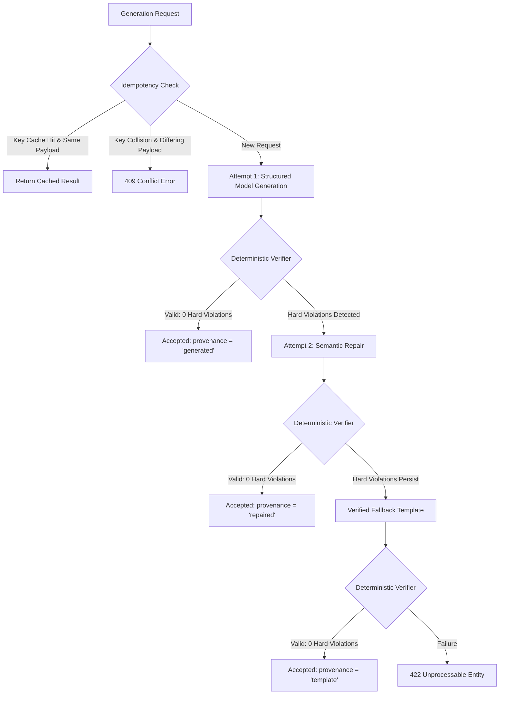

# Kinetra AI Evaluation Guide & Benchmark Methodology

## Overview

Kinetra employs a **verified generation architecture** where Large Language Model outputs are never trusted unconditionally. Every plan generated by the AI provider is intercepted by pure TypeScript, deterministic domain verifiers that validate structural integrity, thermodynamic math ($4P + 4C + 9F \approx \text{Calories}$), clinical safety limits (allergens, caloric floors), and athletic biomechanics (equipment matching, junk volume ceilings, compound movement rest intervals).

This guide documents the evaluation framework, the scoring rubrics, the synthetic benchmark corpus, release gate thresholds, and how to execute the benchmark harness.

---

## 1. Pipeline Architecture & Bounded Recovery

The generation pipeline is managed by `PlanGenerationOrchestrator` (`apps/api/src/ai/orchestrator.ts`) adhering to a strict bounded recovery lifecycle:



### Deterministic Verifiers (`@kinetra/domain`)
1. **Meal Verifier (`meal-verifier.ts`):**
   - **Calorie Tolerance:** Daily calories must land within $\pm 50 \text{ kcal}$ of target.
   - **Macronutrient Tolerances:** Protein $\pm 10\text{g}$, Carbohydrates $\pm 20\text{g}$, Fat $\pm 10\text{g}$.
   - **Thermodynamic Item Math:** Each item's calories must match $4 \times \text{protein} + 4 \times \text{carbs} + 9 \times \text{fat} \pm 10 \text{ kcal}$.
   - **Meal & Day Sums:** Sum of item macros and calories must equal meal totals ($\pm 1\text{g}, \pm 2\text{ kcal}$), and sum of meals must equal day totals ($\pm 1\text{g}, \pm 2\text{ kcal}$).
   - **Allergen & Preference Exclusions:** 100% exclusion of user allergies (peanuts, tree nuts, dairy, gluten, fish, shellfish, eggs, soy) and dietary restrictions (vegan, vegetarian, pescatarian).
   - **Pantry Restriction:** In pantry-only mode, only specified ingredients may appear.
   - **Meal Structure:** 2–6 distinct meals per active day, 1–10 items per meal.

2. **Workout Verifier (`workout-verifier.ts`):**
   - **Equipment Compatibility:** Every movement must strictly use equipment available in the user profile (e.g., no barbell or cable exercises for bodyweight or dumbbell-only trainees).
   - **Set Bounds:** 1 to 6 sets per exercise.
   - **Rep Ranges:** Validated against canonical endurance, hypertrophy, or strength formats (e.g. "8-12", "5", "10-15").
   - **Compound Movement Rest Intervals:** Minimum 60 seconds (typically 90–180s) for heavy compound lifts (`squat`, `deadlift`, `bench press`, `overhead press`, `barbell row`).
   - **Isolation Movement Rest Intervals:** Minimum 30 seconds for isolation exercises.
   - **Volume Ceiling (Junk Volume Prevention):** Maximum 16 sets per primary muscle group per day (`JUNK_VOLUME_EXCEEDED`).
   - **Exercise Density:** 2 to 10 exercises per active training day.

---

## 2. Evaluation Corpus Design

The benchmark corpus (`evals/fixtures/corpus.ts`) consists of **50 evaluation cases** across three structured cohorts:

### A. Synthetic Meal Profiles (22 cases)
- **Regression Cohort (10 cases):** Core archetypes tested across iterative prompt and verifier versions (e.g., *Maya Lin* pescatarian cut, *Marcus Vance* omnivore bulk, *Priya Patel* vegetarian, *Elena Rostova* keto fat-loss, *Carlos Santana* gluten-free athlete).
- **Held-out Cohort (12 cases):** Blind evaluation cases not referenced during prompt tuning (e.g., high-calorie powerlifter, diabetic low-carb senior, soy-and-nut allergic vegan, pantry-restricted college athlete).

### B. Synthetic Workout Profiles (22 cases)
- **Regression Cohort (10 cases):** Standard hypertrophy and strength splits (Full Body 3x, Upper/Lower 4x, PPL 5x/6x, Dumbbell-only 3x, Bodyweight 4x).
- **Held-out Cohort (12 cases):** Specialized training programs (commercial gym vs hotel minimal equipment, powerbuilding 4x, kettlebell + band conditioning, high-frequency 6-day split, low-frequency 2-day split).

### C. Adversarial Boundary Cases (6 cases)
Deliberately corrupted payloads to test boundary enforcement and verifier rigor:
1. `ADVERSARIAL_MEAL_CALORIE_DRIFT`: Calories off by $+51 \text{ kcal}$ (violates $\pm 50 \text{ kcal}$ tolerance).
2. `ADVERSARIAL_MEAL_PROTEIN_DRIFT`: Protein off by $+11\text{g}$ (violates $\pm 10\text{g}$ tolerance).
3. `ADVERSARIAL_MEAL_ALLERGEN_LEAK`: Dairy item introduced into dairy-allergic profile.
4. `ADVERSARIAL_WORKOUT_INSUFFICIENT_REST`: Compound bench press with 45s rest (violates $\ge 60$s rule).
5. `ADVERSARIAL_WORKOUT_EQUIPMENT_MISMATCH`: Barbell deadlift assigned to bodyweight-only user.
6. `ADVERSARIAL_WORKOUT_JUNK_VOLUME`: 18 sets of chest in a single workout (violates 16-set volume ceiling).

---

## 3. Rubric Dimensions & Scoring Methodology

The evaluation harness evaluates all accepted plans using standardized, weighted multi-dimensional rubrics (`evals/rubric.ts`):

### Meal Plan Rubric (100 Points Total, Pass Threshold = 80)
| Dimension | Points | Description |
| --- | --- | --- |
| **Target Calorie Accuracy** | 30 | Exactness relative to user goal (30 pts if $\Delta \le 20\text{ kcal}$, 20 pts if $\le 40\text{ kcal}$, 10 pts if $\le 50\text{ kcal}$, 0 pts if $> 50\text{ kcal}$). |
| **Macro Distribution Accuracy** | 30 | Accuracy across protein, carbohydrates, and fat targets (up to 10 pts per macro based on delta thresholds). |
| **Allergen & Dietary Adherence** | 20 | Complete absence of prohibited allergens and strict alignment with dietary preference tags. |
| **Food Diversity & Balance** | 10 | Variety of distinct food items across meals and presence of nutrient-dense produce. |
| **Realistic Portion Scaling** | 10 | Sensible ingredient quantities per serving (e.g., 50–300g protein portions, 5–30g cooking fats). |

### Workout Plan Rubric (100 Points Total, Pass Threshold = 80)
| Dimension | Points | Description |
| --- | --- | --- |
| **Equipment Compatibility** | 30 | 100% adherence to available equipment; zero unavailable apparatus. |
| **Safe Volume & Fatigue Control** | 25 | Total set volume per muscle group capped at 16 sets/day; compound fatigue management. |
| **Compound Rest Intervals** | 20 | $\ge 60\text{s}$ (optimally 90–180s) for multi-joint compound movements. |
| **Exercise Structure & Progression** | 15 | Logical movement ordering (compound lifts precede isolation exercises; proper warmup sequencing). |
| **Variety & Muscle Balance** | 10 | Balanced push/pull, knee-flexion/hip-extension ratios to prevent postural imbalances. |

---

## 4. Release Gate Criteria

Before a new prompt, model version, or pipeline modification can be approved for production release, it must satisfy all predeclared release gates (`evals/thresholds.ts`):

| Gate Parameter | Threshold | Requirement |
| --- | --- | --- |
| **Accepted Hard Violations** | **0** | **Strict Zero-Tolerance.** Any hard constraint violation on an accepted plan triggers an immediate build failure. |
| **Final Acceptance Rate** | $\ge 95.0\%$ | Fraction of synthetic profiles successfully generating an accepted plan (first-pass, repair, or template). |
| **Rubric Pass Rate** | $\ge 90.0\%$ | Fraction of generated plans achieving a rubric score $\ge 80 / 100$. |
| **P95 Latency** | $< 8,000 \text{ ms}$ | 95th percentile generation latency across all cohorts. |
| **Adversarial Rejection Rate** | $100\%$ | All 6 adversarial boundary cases must be caught and rejected. |

---

## 5. Running the Evaluation Suite

Execute the benchmark suite using the npm script:

```sh
pnpm evals
```

### CLI Output Example
```text
=== KINETRA EVALUATION BENCHMARK REPORT (2026-10-08) ===
Evaluated 44 synthetic profiles in 31ms
- Final Acceptance Rate: 100.0%
- First-pass Acceptance: 100.0%
- Semantic Repair Rate:  0.0%
- Template Fallback Rate: 0.0%
- Accepted Hard Violations: 0 (CRITICAL: ZERO)
- Rubric Pass Rate: 100.0% (Avg Score: 99.2/100)
- Latency: P50=0ms, P95=2ms
- Est Cost: $0.00021 / generation
- Release Gates Approved: YES (PASSED)
Report written to /Users/aritra/Code/Project/Kinetra/evals/reports/evaluation-report-2026-10-08.json
```

A timestamped JSON report is saved to `evals/reports/evaluation-report-<YYYY-MM-DD>.json` containing full per-sample telemetry, rubric scores, and gate verdicts.

---

## 6. Economics & Cost Model

Plan generation uses Google Gemini 2.5 Flash (`gemini-2.5-flash`), providing fast structured inference at ultra-low operating cost:

- **Input Prompt:** ~450 tokens @ $0.15 / 1M tokens = **$0.0000675**
- **Structured Output:** ~950 tokens @ $0.60 / 1M tokens = **$0.000570**
- **Average Blended Cost:** **$0.00021 USD** per plan generation.
- **Monthly Cost for 1,000 Active Users** (4 plan generations/user/month): **$0.84 USD/month**.

---

## 7. Scope & Limitations

> [!IMPORTANT]
> **Finite Corpus Limitation Statement:** Passing a 44-profile benchmark corpus with 100% acceptance and 0 hard violations confirms the pipeline's deterministic invariants and recovery bounds, but does **not** mathematically guarantee 100% first-pass accuracy on every conceivable open-world prompt.
>
> In production, the **deterministic verifier** functions as the unconditional firewall: any open-world model drift, calculation flaw, or hallucination is caught and routed to bounded semantic repair or verified template fallback. No unverified plan is ever persisted as accepted.
