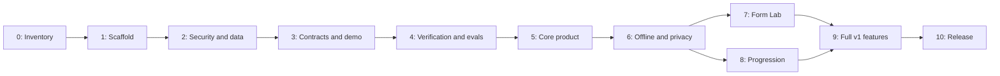

# Kinetra phased completion plan

**Status:** implementation backlog, based on the documentation-only checkout inspected on 2026-10-01. No application task below is claimed complete.

This plan consolidates the original reviews into an ordered path to a usable initial release and full v1. It prioritizes a runnable foundation, tenant security, verified AI output, privacy, and an early synthetic demo. The architecture and workflow are [documented separately](ARCHITECTURE.md) and [here](WORKFLOW.md).

## 1. How to use this plan

- Work through phases in dependency order. Start a later phase only when its required contracts and gates are satisfied.
- Each numbered step has a stable ID, an action, and an acceptance expectation. Create issues or smaller subtasks under those IDs as implementation detail becomes clear.
- Mark a step complete only after its checks pass. Attach a PR/commit and report, screenshot, or reproducible command result to the milestone record.
- Record not-applicable legacy tasks with an explanation; do not silently skip them.
- Keep a scope change visible. Adding a feature means assigning its dependencies and acceptance criteria, not extending “done” indefinitely.
- Documentation and synthetic demos progress throughout development. Real user collection waits for privacy and authorization gates.

Suggested evidence record:

| Task ID | Owner | State | Change link | Acceptance evidence | Remaining limitation |
| --- | --- | --- | --- | --- | --- |
| P0-01 | Engineering Lead | done | [ADR 0001](decisions/0001-greenfield-architecture.md) | [docs/BASELINE_REPORT.md](BASELINE_REPORT.md) §2 | Greenfield build confirmed; legacy migration tasks flagged N/A |
| P0-02 | Engineering Lead | done | [docs/BASELINE_REPORT.md](BASELINE_REPORT.md) | [docs/BASELINE_REPORT.md](BASELINE_REPORT.md) §2 | N/A - legacy prototype absent from checkout |
| P0-03 | Security & AI Lead | done | [docs/BASELINE_REPORT.md](BASELINE_REPORT.md) | [docs/BASELINE_REPORT.md](BASELINE_REPORT.md) §3 | 6 negative acceptance tests defined for Phase 2 gates |
| P0-04 | Product & Domain Lead | done | [ADR 0004](decisions/0004-scope-governance-and-domain-policy.md) | [docs/BASELINE_REPORT.md](BASELINE_REPORT.md) §4 | 6 destinations frozen; non-core & unscientific features excluded |
| P0-05 | Architecture Lead | done | [docs/decisions/](decisions/) | ADR 0001–0004 approved | Foundation decisions recorded in ADRs |
| P0-06 | Engineering Lead | done | [docs/BASELINE_REPORT.md](BASELINE_REPORT.md) | [docs/BASELINE_REPORT.md](BASELINE_REPORT.md) §6 | Task board and baseline report established |

Use states `not started`, `in progress`, `blocked`, `in review`, and `done`. A blocked task should name the missing dependency and the action needed to resolve it.

## 2. Milestones and dependency map

| Milestone | Included phases | Deliverable |
| --- | --- | --- |
| M0: Confirmed baseline | 0 | Agreed scope and source inventory |
| M1: Secure foundation | 1–2 | Runnable workspace and isolated account data |
| M2: Trustworthy demo | 3–4 | Synthetic personas and evaluated verified plans |
| M3: Initial usable release | 5–6 | Core UI, logs, privacy controls, offline behavior |
| M4: Full v1 candidate | 7–9 | Form Lab, progression, supporting features, operational readiness |
| M5: Full v1 release | 10 | Deployed, reproducible, documented and validated product |

A small team may work on Form Lab and progression concurrently after M3 because their contracts are stable. A solo developer should complete one before starting the other. Do not introduce multiple providers, a framework rewrite, and auth migration at the same time.

Initial release can ship at M3 after the applicable release and operational checks from Phases 9–10 are brought forward. It must be labeled as the initial release and list the remaining full-v1 features. Full project completion means M5, not just a working demo.

## 3. Phase 0 — Confirm scope and recover the baseline

**Dependencies:** none. **Output:** inventory, scope, decisions, and confirmed findings.

- [x] **P0-01 — Decide whether this is a migration or greenfield build.** Locate the app referenced by the reviews, if available. Record repository/ref, source directories, runtime, and deployment ownership. If unavailable, record that Kinetra starts from this docs-only repository; remove legacy migration assumptions from implementation tickets.
- [x] **P0-02 — Reproduce the existing app when applicable.** Install from its lockfile, run documented commands, exercise onboarding, generation, logging, offline behavior, and sign-in. Capture actual failures and environment requirements without exposing secrets.
- [x] **P0-03 — Turn historical findings into confirmed issues.** Check client API-key acceptance, anonymous generation, HTML insertion, photo persistence, quota races, timezone handling, and ownership rules. Use reproduction cases instead of copying old line numbers. For greenfield, convert them into negative acceptance tests.
- [x] **P0-04 — Freeze initial-release and full-v1 scope.** Confirm the six destinations and retained features. Exclude skincare and body-fat-from-photo claims. Record deferred barcode/OCR, wearables, social features, and other ideas separately.
- [x] **P0-05 — Close foundation decisions.** Choose auth migration strategy, Node hosting runtime, API transport, initial provider candidate, license decision owner, and domain-policy reviewer. Record alternatives and consequences as decision files.
- [x] **P0-06 — Create a task board and baseline report.** Link these phase IDs to issues, identify owners and dependencies, and record existing tests/performance only if measured. No application metrics are currently available from this checkout.

**Exit gate:** source strategy and release scope are explicit; historical security concerns have tests or confirmed issues; no unverified metric is presented as current behavior. Passed on 2026-10-01 (see [docs/BASELINE_REPORT.md](BASELINE_REPORT.md)).

## 4. Phase 1 — Runnable typed foundation

**Dependencies:** Phase 0. **Output:** reproducible workspace with a thin end-to-end slice.

- [ ] **P1-01 — Scaffold pnpm workspaces.** Create web, API, contracts, domain, database, and shared configuration packages. Pin compatible Node/pnpm/dependency versions and commit the lockfile.
- [ ] **P1-02 — Add strict TypeScript and dependency boundaries.** Compile all packages, prevent server imports in browser code, and prohibit implicit `any`. Validate external input as `unknown` before use.
- [ ] **P1-03 — Choose and configure one formatter/linter.** Add shared config and non-mutating CI checks; avoid duplicate competing toolchains.
- [ ] **P1-04 — Implement the transport/deployment spike.** Run a typed Hono/tRPC request and a dedicated SSE stream locally and in a preview. Verify auth-header transport, cancellation, event framing, runtime compatibility, and hosting timeout behavior.
- [ ] **P1-05 — Define environment contracts.** Add per-app examples with placeholders, ignored local files, startup validation, and separate dev/preview/production configuration. Scan web artifacts for secret variable names and seeded test secrets.
- [ ] **P1-06 — Add local database/auth setup and synthetic seeds.** Document prerequisites, ports, reset commands, and migration commands. A fresh developer environment must boot without production credentials.
- [ ] **P1-07 — Add the initial CI workflow.** Run formatting, lint, types, a basic unit/contract test, and production build on PRs. Confirm a deliberately failing check blocks the gate.
- [ ] **P1-08 — Replace README setup placeholders.** Test documented commands from a fresh clone and record exact script behavior, runtime versions, and troubleshooting.

**Exit gate:** fresh setup succeeds; the preview serves a typed request and real SSE stream; CI passes; no server secrets are bundled into the client.

## 5. Phase 2 — Security, identity, data, and privacy foundation

**Dependencies:** Phase 1 and any source recovery. **Output:** tenant-isolated storage and a closed AI boundary.

- [ ] **P2-01 — Implement sign-in/session handling.** Require verified identity on account data and AI routes. Missing or expired sessions return a clear unauthenticated result. Auth service failure must not turn paid generation into guest access.
- [ ] **P2-02 — Migrate existing identity only if needed.** Map old user IDs to new subjects, check record/object counts and ownership, and rehearse recovery. Otherwise record a greenfield decision and test creation of a new profile.
- [ ] **P2-03 — Implement owner-scoped database tables and RLS.** Create profiles, daily logs, training sessions, plans/versions, usage buckets, operations, and required privacy records. Test anonymous, owner, and second-account access directly against the database and API.
- [ ] **P2-04 — Remove unsafe provider access.** Accept only server-configured provider keys. Reject client keys, legacy key paths, arbitrary model/endpoint selection, oversized payloads, and unsupported methods before any provider request.
- [ ] **P2-05 — Implement atomic quotas and request budgets.** Enforce per-account limits, concurrency, payload sizes, and global provider budgets. Stress concurrent requests and prove the configured limit cannot be exceeded through a read/update race. Schedule expired-bucket cleanup.
- [ ] **P2-06 — Secure rendering and browser policy.** Prefer framework text rendering, replace inline handlers, and sanitize explicitly supported rich content. Add headers appropriate to auth/CDN usage, pinned assets where applicable, and an effective CSP. Verify normal auth and unsafe payload cases in the deployed preview.
- [ ] **P2-07 — Allow-list profile persistence.** Exclude images, credentials, UI-only state, and unknown keys. Coalesce saves and use revisions to avoid racing updates. Verify request size and saved fields.
- [ ] **P2-08 — Fix date and unit semantics.** Normalize calculation units, store UTC event timestamps, retain local date/timezone, and test midnight, daylight-saving transitions, travel, and edited past entries.
- [ ] **P2-09 — Define consent and retention policy.** Decide real periods per data class, provider-processing disclosure, and separate camera/storage consent. Specify export/deletion behavior and backup limitations. Publish `PRIVACY.md` before inviting real users; its promises must match implemented controls.
- [ ] **P2-10 — Test migration and administrative access.** Run fresh and upgrade migrations, verify constraints and RLS, and test narrowly scoped cleanup jobs. Reserve privileged credentials for explicit jobs.

**Exit gate:** unauthorized and wrong-owner access is denied; quota concurrency and untrusted text checks pass; no photo bytes enter profile JSON; retention/consent decisions are documented. Do not collect real user data until Phase 6 export/deletion controls also pass.

## 6. Phase 3 — Domain contracts and an early synthetic demo

**Dependencies:** Phases 1–2. **Output:** typed core, shared schemas, and an immediately usable demonstration.

- [ ] **P3-01 — Define canonical schemas.** Cover profiles, logs, training sessions, meal/workout plans, coach events, and voice extraction. Bound values and lengths, reject invalid numbers/units, and version persisted payloads.
- [ ] **P3-02 — Port or build calculations as pure functions.** Implement required energy/target/macro/unit calculations with explicit assumptions and cited policy rationale. Test boundaries and invalid inputs; distinguish estimates from measured values.
- [ ] **P3-03 — Build a normalized ingredient/exercise catalog.** Define identifiers, units, nutrition provenance, equipment requirements, aliases, exclusions, and unknown-value handling. Record where information is estimated.
- [ ] **P3-04 — Implement feature repository interfaces.** Support profiles, logs, plans, and history through interchangeable API and demo repositories. Do not scatter demo-specific conditions through UI components.
- [ ] **P3-05 — Create two synthetic personas.** Include contrasting goals, at least 14 days of plausible logs, accepted plan fixtures, and training history. Clearly label data as synthetic and keep sample values out of clinical claims.
- [ ] **P3-06 — Add demo entry and reset.** Support a documented demo URL/persona selector. Disable server writes and provider calls; reset to deterministic fixtures. Verify demo storage cannot leak into a later signed-in account.
- [ ] **P3-07 — Publish a demo walkthrough.** Show the first useful screen immediately, then a plan and progress view. Record limitations and verify it works without auth or provider configuration.

**Exit gate:** shared contracts and calculation tests pass; both personas work reproducibly; no demo action calls paid generation or modifies account data.

## 7. Phase 4 — Verified AI pipeline and evaluations

**Dependencies:** Phase 3, secure provider boundary, catalogs and policy review. **Output:** accepted plans with reproducible verification evidence.

- [ ] **P4-01 — Implement the primary provider adapter.** Probe current structured output and streaming capabilities for the chosen model. Pin model configuration and translate the canonical schema to supported provider constraints. Record probe date and observed limitations.
- [ ] **P4-02 — Build deterministic meal verification.** Check configured energy/macro totals, day/meal counts, duplicates, explicit restrictions, ingredient resolution, and pantry-only mode when requested. Treat soft preferences separately from hard exclusions. Include tests near each tolerance boundary.
- [ ] **P4-03 — Build deterministic workout verification.** Check requested days, exercise/equipment compatibility, sets/reps, rest policy, configured volume bounds, and unsupported entries. Domain review must validate the policy; tests verify the policy's implementation.
- [ ] **P4-04 — Implement bounded recovery.** Allow one semantic repair and only budgeted transport retry/fallback. Apply a global deadline/call/token cap across all attempts. Verify no infinite repair loop, overlapping attempt, or silent acceptance of invalid output.
- [ ] **P4-05 — Add verified fallback templates.** Run templates through the same schemas and verifier against the user's constraints. If no valid result exists, return a safe, actionable failure. Label generated, repaired, cached, and template results accurately.
- [ ] **P4-06 — Implement generation idempotency.** Deduplicate owner/key/input combinations; reject key reuse with a different payload. Test concurrent double submissions, worker interruption, and replay after completion.
- [ ] **P4-07 — Add redacted observability.** Track latency, operation ID, provider/model, prompt/schema/policy versions, attempts, rejection reasons, and usage where available. Do not store raw health prompts or photos in telemetry.
- [ ] **P4-08 — Create an evaluation corpus and rubric.** Start with at least 20 synthetic profiles per retained structured generator, varying goals, preferences, equipment, and difficult cases. Include malformed, oversized, adversarial, and numerically inconsistent outputs. Keep regression cases separate from held-out evaluation cases.
- [ ] **P4-09 — Run and publish evaluations.** Report first-pass and final acceptance, hard-constraint violations, repair/fallback rates, latency, and subjective rubric scores. Include sample count, seed/config, model and policy versions, cost assumptions, and every failure category. Create an evaluation guide and dated report.
- [ ] **P4-10 — Approve release thresholds before selecting a candidate.** Require zero accepted hard-constraint violations in the test corpus and explicitly choose quality/latency/budget thresholds. Passing a finite corpus is not a guarantee for all inputs; state that limit.

**Exit gate:** malformed or constraint-breaking output cannot be persisted as accepted; recovery is bounded; evaluation results are reproducible and meet predeclared thresholds. Add only measured numbers to the README.

## 8. Phase 5 — Core product and instrument UI

**Dependencies:** Phase 4. **Output:** complete online path from onboarding to recorded progress.

- [ ] **P5-01 — Implement accessible visual primitives.** Define surfaces, text scale, numeric typography, contrast, focus, spacing, and motion tokens. Build inputs, buttons, dialogs, error/status components, and chart summaries with keyboard checks.
- [ ] **P5-02 — Build progressive onboarding.** Gather required profile fields, validate per step, preserve drafts, support back navigation, and collect optional preferences later. Show assumptions and units clearly; do not require camera access.
- [ ] **P5-03 — Build Today.** Present one clear next action, current plan summary, today's logging status, and visible connectivity/sync status. Distinguish a recommendation from completed work.
- [ ] **P5-04 — Build Measure.** Show calculation assumptions, target estimates, trend history, units, and understandable empty states. Never present an estimate as diagnostic measurement.
- [ ] **P5-05 — Build Plan.** Generate and display only verified content. Save immutable versions, allow explicit revisions/pinning, and link directly to a version. Preserve previous accepted plans after provider failure.
- [ ] **P5-06 — Build Progress and daily logs.** Support create/edit/delete, bounded history, charts, and milestone summaries. Preserve unsaved inputs across tab/route changes and reconcile server revisions.
- [ ] **P5-07 — Add reminders with honest delivery semantics.** Persist preferences, use timezone-aware timestamps, and check missed windows after visibility changes. Describe local/in-app reminders as such; do not promise reliable background push without implementation.
- [ ] **P5-08 — Finish the imported-feature cleanup when applicable.** Remove obsolete globals, circular imports, duplicated tab maps, unused CSS, double-loaded styles, stale branding, and insecure legacy paths. Verify each migrated feature before deleting its old implementation.
- [ ] **P5-09 — Decide language support.** Initial baseline is complete English. If another language is adopted, inventory all copy and test it; otherwise remove any partial multilingual claim.
- [ ] **P5-10 — Exercise the full online journey.** Fresh account → onboarding → verified plan → log → edit → history → sign-out. Check phone layouts, keyboard operation, focus behavior, and meaningful loading/error states.

**Exit gate:** the full online journey works; drafts survive navigation; history and plan versions are consistent; UI claims match actual behavior.

## 9. Phase 6 — Offline completion and user data controls

**Dependencies:** Phase 5 and privacy policy. **Output:** usable initial release with resilient logs and complete data lifecycle.

- [ ] **P6-01 — Implement account-scoped IndexedDB caches.** Cache explicitly selected profiles/plans/history, version the local schema, and clear account data on logout. Test account switching and migration of a previous local schema.
- [ ] **P6-02 — Implement an atomic outbox.** Save the local change and queued mutation in one transaction. Include owner, mutation ID, base revision, ordering, attempts, and timestamps.
- [ ] **P6-03 — Implement safe synchronization.** Deduplicate server writes, order per entity, retry transient errors, pause auth errors, and preserve failed items. Test disconnect during replay and a reload with pending changes.
- [ ] **P6-04 — Resolve cross-device conflicts.** Return current server revisions, preserve the local edit, and offer a clear compare/select flow. Test two devices editing the same date offline; avoid silent data loss.
- [ ] **P6-05 — Build visible sync feedback.** Show pending count, last sync, offline availability, rejected writes, and retry actions. Verify UI state reflects durable queue state.
- [ ] **P6-06 — Complete PWA lifecycle.** Add manifest, PNG/maskable/install assets, versioned caching, navigation fallback, and an update prompt. Rehearse upgrades with unsaved forms and pending outbox records. Background Sync is optional; baseline replay must work without it.
- [ ] **P6-07 — Implement export.** Include owned profile, logs, sessions, plans/versions, preferences, and applicable consent/photo metadata in a documented portable format. Test completeness, ownership, pagination, and date/unit preservation.
- [ ] **P6-08 — Implement deletion.** Require recent identity confirmation, block new writes, revoke shares, clear objects/records, and reconcile retries before identity removal. Test partial failure, replay, storage orphans, and local data cleanup; document backup/offline-device limitations.
- [ ] **P6-09 — Implement private photo controls if photos are enabled.** Enforce consent, validated upload sizes/types, owner paths, short-lived reads, delete actions, and scheduled retention. If deferred until Phase 9, keep photo collection disabled in the initial release.
- [ ] **P6-10 — Run the initial-release gate.** Test provider outage, cached plan access, offline logging, reconnect/conflict, export, deletion, and no wrong-owner access. Complete the release/rollback smoke requirements from Phases 9–10 before opening real-user access.

**Exit gate:** the initial release has no silent log loss; export and deletion match `PRIVACY.md`; offline caches cannot cross accounts; critical journeys pass in the deployment environment.

## 10. Phase 7 — Local Posture & Form Lab

**Dependencies:** stable UI/contracts and camera consent. **Output:** one supported exercise with reproducible local analysis.

- [ ] **P7-01 — Define the supported exercise and capture conditions.** Start with one exercise such as a squat; document viewpoint, space, lighting, devices, confidence limits, and unsupported situations.
- [ ] **P7-02 — Integrate local pose processing.** Lazy-load the selected pose model, manage permissions/device switching, and release streams/resources on exit. Verify denied permission and unsupported devices have useful fallback screens.
- [ ] **P7-03 — Implement signal processing.** Confidence-filter and smooth landmarks, compute supported image-plane angles, use a hysteresis-based rep state machine, and derive tempo from timestamps.
- [ ] **P7-04 — Create labeled landmark fixtures.** Include normal reps, partial reps, pauses, occlusion, low frame rate, camera movement, and noise. Use consented recordings or synthetic landmark sequences, never unapproved user photos.
- [ ] **P7-05 — Evaluate rep counts and tempo.** Publish the dataset size, expected labels, counting error, tempo error, supported conditions, and failures. Choose an acceptance threshold before comparing implementations.
- [ ] **P7-06 — Build understandable feedback.** Display landmark overlays and limited actionable cues; suppress confident scoring below the supported confidence threshold. Provide a text summary accessible without viewing the overlay.
- [ ] **P7-07 — Verify privacy and performance.** Confirm frames stay local, storage is opt-in, background capture stops, and target phones remain usable. Record actual performance rather than assuming every device can run the model.

**Exit gate:** supported conditions pass the labeled evaluation; low-confidence cases show uncertainty; no body-fat/diagnostic claims exist; camera lifecycle and local-processing checks pass.

## 11. Phase 8 — Explainable adaptive progression

**Dependencies:** verified workout plans and sufficient training-history schema. **Output:** conservative, reviewable next-plan adjustments.

- [ ] **P8-01 — Define a versioned progression policy.** Document required history, effort scale, missed-session treatment, plateau criteria, progression/deload bounds, and excluded populations/scenarios. Obtain domain review.
- [ ] **P8-02 — Build the pure rule engine.** Input completed sessions and current prescription; output a proposed adjustment, evidence window, reason, confidence, and policy version. Do not ask an LLM to invent numeric load changes.
- [ ] **P8-03 — Test edge cases.** Cover inadequate data, unit conversion, changed exercises, missed sessions, conflicting effort reports, and upper/lower adjustment boundaries.
- [ ] **P8-04 — Add user review.** Show what changed and why; allow acceptance or rejection. Accepted changes create a new verified plan version, preserving the original history.
- [ ] **P8-05 — Run scenario evaluation.** Use synthetic improvement, plateau, inconsistent logging, and recovery scenarios. Document expected decisions and differences; do not claim real-user effectiveness without a suitable study.

**Exit gate:** every adjustment is reproducible, bounded, explained, user-reviewed, and attached to a versioned policy; insufficient data produces no forced adjustment.

## 12. Phase 9 — Complete full-v1 features and harden operations

**Dependencies:** Phases 6–8. **Output:** integrated v1 candidate and operational evidence.

- [ ] **P9-01 — Complete streaming Coach.** Use bounded relevant history, escaped text, cancellation, terminal states, and actionable provider errors. Test network interruption and prevent accidental duplicate responses or unbounded context.
- [ ] **P9-02 — Complete voice logging.** Handle capability/permission limits, extract into a shared schema, show editable confirmation, and save only after the user confirms. Typed logging must remain fully usable.
- [ ] **P9-03 — Implement revocable plan sharing.** Share a selected immutable version through an expiring grant; exclude profile, logs, photos, and unrelated metadata. Test token revocation, owner access, and public-route disclosure.
- [ ] **P9-04 — Complete optional progress photos.** Deliver the private storage/retention controls from P6-09, an accessible timeline/comparison, and photo deletion. Keep photos optional and separately consented.
- [ ] **P9-05 — Evaluate one fallback provider.** Probe capabilities against every routed task, run the same evaluations, and add a circuit breaker plus bounded fallback policy only when it meets thresholds. If no provider qualifies, document that and use verified cached/templates as the failure path; do not weaken validation.
- [ ] **P9-06 — Build operational dashboards and alerts.** Measure provider failures, generation rejection/recovery, p50/p95 latency, request budgets, queue errors, deletion jobs, and storage cleanup. Define thresholds and actionable ownership; missing token data is unknown.
- [ ] **P9-07 — Complete the critical browser suite.** Keep five maintained journeys: synthetic demo; onboarding and verified plan; log/edit/history; offline reconnect/conflict; export/deletion. Each journey includes relevant keyboard/accessibility checks. Add focused component/contract tests for streaming, voice, sharing, and camera instead of duplicating every behavior in E2E.
- [ ] **P9-08 — Audit accessibility manually and automatically.** Check screen-reader labels, focus order/traps, charts, live updates, contrast, zoom, touch targets, and reduced motion. Record tested browser/screen-reader combinations and fix blocking defects.
- [ ] **P9-09 — Measure performance and cost.** Establish seeded-route baselines under a defined mobile/network profile, lazy-load camera/charts, and verify bundle budgets. Publish dated model cost assumptions with measured usage and unknowns.
- [ ] **P9-10 — Rehearse production recovery.** Restore a backup into an isolated environment, roll back a compatible web/API release, verify migration repair, and exercise provider outage, expired auth, deletion retry, and service-worker update failures.
- [ ] **P9-11 — Complete supporting docs.** Add `CONTRIBUTING.md`, finalized `PRIVACY.md`, evaluation guide, deployment/rollback runbook, selected `LICENSE`, environment examples, and release notes. Confirm links and actual setup commands.

**Exit gate:** required full-v1 features pass their acceptance checks; eval thresholds and browser journeys pass; no unresolved release-blocking privacy, access-control, or data-loss defects remain; recovery has been rehearsed.

## 13. Phase 10 — Release, validate, and close v1

**Dependencies:** Phase 9. **Output:** released v1 with honest evidence and bounded remaining scope.

- [ ] **P10-01 — Freeze the release candidate.** Record the commit, schema/prompt/policy/model versions, supported features, known limitations, and blocker list. Resolve blockers before deployment.
- [ ] **P10-02 — Validate environment separation.** Check production keys, auth redirect domains, private storage policy, CSP, quotas, logging, monitoring, and database access. Preview/test data must not become production seed data accidentally.
- [ ] **P10-03 — Apply reviewed migrations and deploy.** Follow the workflow's migration order, backup plan, and compatible rollout. Record what was deployed and recovery instructions.
- [ ] **P10-04 — Run deployed smoke checks.** Use a synthetic test account to verify auth, plan generation/rejection, logs, offline replay, stream completion, sharing, export/deletion, and camera permission/resource cleanup.
- [ ] **P10-05 — Publish the portfolio/demo evidence.** Add the working live/demo URLs, current screenshots, architecture diagram, dated eval results, measured test scope, and two short recordings showing useful behavior. Do not reuse the historical review's coverage or cost claims.
- [ ] **P10-06 — Conduct a small usability review.** Recruit consenting reviewers, give concrete tasks, record completion/blockers without unnecessary health data, and fix failures in the main journey. Report sample size and limitations.
- [ ] **P10-07 — Review post-release signals.** Choose an observation window before launch, check errors and budget/sync/deletion dashboards, and resolve significant regressions. Absence of traffic is not evidence of reliability.
- [ ] **P10-08 — Close the v1 milestone.** Link evidence for every required gate, document intentional exclusions, and move optional follow-ups into a separate next-release backlog.

**Exit gate:** the deployment is usable and observable; setup and evaluations are reproducible; documentation accurately describes shipped behavior; outstanding issues are explicitly non-blocking and owned.

## 14. Release-blocking conditions

A milestone cannot pass with any of these unresolved:

- Anonymous or wrong-owner access to account data or paid generation.
- Accepted plans that fail their configured hard constraints.
- Unbounded provider attempts, missing quota enforcement, or exposed secrets.
- Silent loss/overwrite of logs or plan history in supported flows.
- Real-user data collection without truthful consent, export, and deletion controls.
- Camera capture continuing after exit or undisclosed photo upload.
- Blocking keyboard, sign-in, or core mobile-journey failures.
- A production schema change without a tested recovery strategy.
- README claims that imply an unimplemented feature or fabricated measurement.

## 15. Planning estimates and risk management

These are planning ranges for one experienced developer after scope confirmation, not promised deadlines. They include implementation and verification but may expand with missing source, domain review, data migration, or provider/device issues.

| Phase group | Indicative effort | Main uncertainty |
| --- | --- | --- |
| Inventory and decisions | 2–4 working days | Access to the prior app and accounts |
| Scaffold and secure data | 1–2 weeks | Auth/RLS and deployment compatibility |
| Contracts, demo, verification, evals | 2–3 weeks | Policy/catalog quality and model output failures |
| Core UI and offline/privacy | 3–4 weeks | Synchronization and deletion edge cases |
| Form Lab and progression | 2–4 weeks | Device behavior and domain review |
| Full-v1 integration and release | 2–3 weeks | External evaluation and operational rehearsal |

Plan roughly **10–17 full-time weeks** for the proposed scope, then revise after Phase 0 and each milestone. Part-time schedules require more calendar time; imported production accounts may add a separate migration workstream.

| Risk | Early signal | Response |
| --- | --- | --- |
| Rewrite consumes the project | UI migration progresses while verification remains unbuilt | Preserve vertical slices; finish M2 before expanding visual scope |
| Provider promises change | Capability probes or quotas no longer match config | Reverify, pin configuration, use validated degraded behavior |
| Nutrition data is unreliable | Totals look plausible but ingredients/units are unresolved | Fix catalog provenance and reject ambiguous hard constraints |
| Auth migration loses ownership | Record counts or identity mapping differ | Stop cutover, reconcile, and rehearse again |
| Offline writes duplicate/overwrite | Replay or two-device tests lose edits | Add dedup/revision checks before opening real-user access |
| Camera scores appear precise but unstable | Occlusion/viewpoint creates inconsistent counts | Narrow supported conditions and expose uncertainty |
| Privacy promises exceed controls | Deletion leaves storage or backup ambiguity | Correct policy and cleanup implementation before launch |
| Portfolio metrics overstate results | README lacks report versions or denominators | Publish reproducible reports with failures and limits |

## 16. Full project completion checklist

- [ ] Initial and full-v1 feature gates have linked acceptance evidence.
- [ ] Security, ownership, quota, rendering, and data-lifecycle checks pass.
- [ ] Deterministic verification and evaluation reports support the AI reliability claims.
- [ ] Offline logs, conflict handling, and service-worker upgrades preserve work.
- [ ] Form Lab and progression meet their explicitly bounded support criteria.
- [ ] Core UI passes mobile, keyboard, and documented screen-reader checks.
- [ ] Production deployment, monitoring, backup recovery, and rollback are tested.
- [ ] A fresh contributor can follow tested setup instructions without production secrets.
- [ ] README, architecture, privacy, workflow, and runbooks describe the released system.
- [ ] Optional next-release ideas are separated from unresolved v1 blockers.
