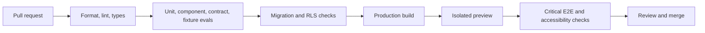

# Kinetra development and delivery workflow

**Status:** Phase 2 local security checks and the CI workflow are implemented. The [Phase 2 report](PHASE_2_REPORT.md) records evidence; observed hosted CI and preview verification remain pending. Later-stage workflows below remain requirements.

Use this document with the [architecture](ARCHITECTURE.md) and [completion plan](PROJECT_PLAN.md). The architecture defines boundaries; the plan defines scope and sequencing; this workflow defines how work becomes a verified release.

## 1. Pick and define a task

1. Select the first unblocked task in the earliest incomplete phase. Do not skip identity, privacy, or validation gates to add visible features.
2. Confirm dependencies and inspect relevant code, tests, schemas, and decisions.
3. Write a small issue or task record with a concrete user problem, proposed behavior, in-scope work, dependencies, acceptance checks, and evidence to attach.
4. Split work that changes several independent boundaries into reviewable increments. A useful increment is a working vertical slice, not a large unintegrated UI rewrite.
5. Assign one owner. For a solo project, the owner is still responsible for checking evidence and documenting unresolved limitations.

Recommended task record:

```text
ID: P4-03
Problem: A generated meal plan can violate a user's exclusions.
Depends on: P3 shared schemas and ingredient catalog policy.
Change: Reject excluded or unresolved ingredients before accepting a plan.
Acceptance: Excluded ingredient fixture rejects; valid fixture passes;
            no accepted version is written for rejected output.
Evidence: Test output, fixture IDs, API response, linked PR.
Out of scope: Provider change and UI redesign.
```

A checkbox records completion only after acceptance evidence exists. If the task does not apply to a greenfield build, record why and identify any replacement verification work.

## 2. Repository and branch discipline

- Keep the default branch releasable once application code exists.
- Create a short-lived branch such as `codex/p4-plan-verifier` or the team's agreed equivalent.
- Inspect the working tree before editing. Preserve unrelated local changes and the original review files.
- Use focused commits with a clear purpose: `feat:`, `fix:`, `test:`, `docs:`, or `chore:` are useful optional prefixes.
- Commit dependency lockfiles and database migrations alongside the code that needs them.
- Never commit credentials, real health-data fixtures, private photos, or production exports.
- Avoid combining auth migration, schema migration, provider changes, and redesign in one PR.

## 3. Establish a reproducible environment

Phase 1 must create and test a root setup contract. Pin Node and pnpm versions, document environment files per application, and provide synthetic local seeds.

The following is the full target script contract. Foundation scripts are implemented; coverage, E2E, and evaluation scripts will be added when those features exist. Use the README for currently runnable commands.

| Script | Intended responsibility |
| --- | --- |
| `pnpm dev` | Start web and API with documented local ports |
| `pnpm lint` | Check source with the selected linter |
| `pnpm format:check` | Check formatting without modifying files |
| `pnpm typecheck` | Check strict TypeScript across workspaces |
| `pnpm test` | Run isolated unit, component, and contract tests |
| `pnpm test:coverage` | Produce measured coverage for defined critical modules |
| `pnpm test:db` | Exercise migrations, tenant policies, and transactional behavior locally |
| `pnpm test:e2e` | Run the critical browser journeys against a test environment |
| `pnpm eval:fixtures` | Validate saved synthetic model outputs and deterministic rules |
| `pnpm eval:live` | Run an explicit budget-limited provider evaluation outside ordinary PR checks |
| `pnpm build` | Build deployable web and API artifacts |
| `pnpm db:migrate` | Apply local migrations; never silently target production |
| `pnpm db:seed` | Insert disposable synthetic development records |

Do not copy these commands into the README as functional until they have passed from a fresh clone. Document whether tests are one-shot or watch mode, required service dependencies, and how to reset the local database.

Environment examples should distinguish browser-safe configuration, server secrets, local defaults, and optional providers. Startup validation should report missing variable names without printing their values. Fail closed when production auth or required provider configuration is absent.

## 4. Implement a vertical slice

1. Define or update the canonical input/output schemas and stable error codes.
2. Add deterministic logic with no UI, database, or SDK imports.
3. Add tenant-scoped persistence and migrations where needed.
4. Add API identity, ownership, quotas, payload limits, and runtime validation.
5. Integrate client query behavior, loading/error/empty states, and accessible controls.
6. Add offline behavior explicitly; do not let optimistic UI imply a successful server save.
7. Verify success, malformed input, unauthorized access, timeout, and recovery paths.
8. Update affected docs and the phase evidence record.

For imported legacy code, first capture behavior with fixtures or smoke tests. Move one feature at a time and remove the old path after parity is demonstrated. Do not preserve insecure behavior merely for parity.

## 5. Verification by change type

| Change | Minimum meaningful checks |
| --- | --- |
| Calculation or policy | Boundary values, units, missing inputs, deterministic expected results |
| AI contract/verifier | Valid and invalid fixtures, ambiguous exclusions, repaired and rejected paths |
| API authorization | Missing/expired token, wrong owner, malformed payload, safe errors |
| Database/RLS | Fresh migration, upgrade path, tenant isolation, constraints, transaction failure |
| Offline logic | Retry, deduplication, revision conflict, logout/account switch, queue persistence |
| UI feature | Interaction, keyboard/focus, errors, mobile layout, escaped untrusted output |
| Streaming | Split events, Unicode chunks, abort, disconnect, timeout, terminal states |
| Privacy/storage | Consent, object ownership, expired URL, export, partial deletion and retries |
| Camera/Form Lab | Permission denial, device shutdown, poor confidence, recorded landmark fixtures |
| Documentation only | Relative links, code fences, factual status, consistency with source and plan |

Coverage is a diagnostic, not a substitute for critical-case tests. Establish a measured baseline before setting a threshold and focus coverage enforcement on calculations, verification, auth, and synchronization. Do not publish a percentage without naming the measured scope and report date.

Keep ordinary PR checks deterministic. Use mocked providers and synthetic saved responses. Live AI evaluations are manual or scheduled separately, with explicit budget, model, prompt version, and reproducible inputs.

## 6. AI and policy changes

For a prompt, schema, model, verifier, or progression-policy change:

1. Version the changed artifact and document the intended behavior difference.
2. Run saved-response validation and adversarial rendering/contract checks.
3. Run the same evaluation dataset against the old and candidate behavior where live calls are needed.
4. Report first-pass acceptance, final acceptance after recovery, fallback rate, hard-constraint violations, latency, and token usage when supplied.
5. Include denominator, failures, configuration, and uncertainty. Report per-feature results so one strong task cannot hide another weak task.
6. Review regression cases and subjective rubric results before enabling the candidate.
7. Keep a rollback configuration and previously verified templates.

Document nutrition and exercise policies with their assumptions and supporting sources. Domain review is a release gate for such policies. Technical tests alone do not establish health suitability.

## 7. Pull requests and review

A PR should explain the concrete problem and resulting behavior. Include relevant validation and migration or rollout details without restating the entire implementation.

Suggested body:

```markdown
## Change
Describe the trigger, previous behavior, and resulting behavior.

## Validation
List meaningful checks and link reports or screenshots.

## Rollout and risks
Describe migration order, compatibility, recovery, and known limits.

## Documentation
Link the updated task and affected architecture decision, if any.
```

Review must answer:

- Does the change meet its acceptance criteria and remain within scope?
- Are trust boundaries validated and ownership enforced server-side?
- Could secrets or private data reach bundles, logs, caches, or fixtures?
- Are user-visible errors actionable and partial work recoverable?
- Can the change be deployed and rolled back with its data dependencies?
- Are claims in the README and demo supported by current evidence?

For a solo project, perform a separate review pass after implementation, preferably with a fresh diff view. Do not mark a gate complete solely because the author wrote it.

## 8. CI and preview environments

Required pipeline once implemented:



Start with the scaffold checks and add gates as features arrive. Validate workflows by observing actual runs. Use separate secrets and data for previews; untrusted fork PRs must not receive production credentials. Seed synthetic data, avoid paid model calls, and clean up temporary preview resources.

Automated accessibility checks supplement keyboard and screen-reader walkthroughs. Run performance checks against a stable seeded route; define a device/network profile and record the baseline rather than setting unsupported score claims.

## 9. Database changes and identity migration

1. Create a versioned migration and update typed models.
2. Test it from an empty database and the previous supported schema.
3. Use synthetic records to test backfills, ownership, local dates, and revisions.
4. Prefer expand → backfill → switch reads/writes → remove old fields in a later release.
5. Verify backup availability and recovery before production mutation.
6. Document whether rollback means an application rollback, a forward repair migration, or a backup restore. Never assume reverting code reverses a destructive schema change.

For a Clerk-to-Supabase migration, map old and new identity subjects explicitly, verify every owned record and object, and rehearse rollback. A docs-only checkout has no verified existing accounts; Phase 0 resolves whether this migration is needed.

## 10. Release procedure

1. Check the applicable milestone gate and record its evidence.
2. Verify preview flows, environment validation, auth redirects, quotas, and provider configuration.
3. Rehearse and apply reviewed migrations with a backup/recovery plan.
4. Deploy compatible API changes, then the web build and service-worker assets.
5. Run production smoke checks using a designated test account and synthetic data.
6. Check sign-in, accepted plan generation, rejected-plan handling, offline queue replay, streaming, and private-data access.
7. Monitor errors, provider failures, quota usage, and synchronization failures against the pre-release baseline.
8. Record release version, commit, migrations, prompt/schema/policy versions, known limitations, and rollback instructions.
9. Update the README only with live links and verified measurements.

A service-worker update must preserve pending edits and prompt for reload at a safe point. Keep old cache compatibility long enough for the supported transition. Production release should be a deliberate action after the reviewable result exists.

## 11. Incidents and maintenance

Classify incidents by affected users and impact: unauthorized data exposure, destructive data loss, blocked core workflows, provider degradation, or minor UI defects. Record the first observed time and affected release.

Contain the fault by disabling the affected feature, revoking exposed credentials if necessary, or rolling back a compatible app version. Preserve redacted evidence. Communicate confirmed impact through the project's chosen support process; do not speculate or expose private data.

After recovery, add a regression test, document cause and remediation, and update the relevant decision or runbook. Provider outages should normally degrade to verified cached plans or a clear unavailable state, not bypass validation.

Suggested maintenance cadence after launch:

- Weekly: review failed jobs, sync conflicts, rejected plans, dependency/security updates, and quotas.
- Monthly: recheck provider capabilities/pricing, refresh evaluation reports, and test cleanup/retention jobs.
- Before major releases: rehearse backup restoration, deletion, auth compatibility, and service-worker upgrade behavior.

## 12. Documentation maintenance

Update docs in the same PR as behavior changes. Maintain architecture decisions for major choices and dated evaluation reports for measured claims. The roadmap is a living checklist; preserve completed task IDs and evidence references when adding new scope.

The current [privacy policy](../PRIVACY.md) describes synthetic local operation and release lifecycle targets. Finalize it against deployed controls before launch. Future supporting files to create at their respective phase: `CONTRIBUTING.md`, a selected `LICENSE`, an evaluation guide, deployment/rollback runbook, and incident notes. Do not publish retention promises or setup commands before implementation can satisfy them.

## Phase 2 verification and handoff

1. Run `pnpm check` for formatting, dependency boundaries, strict types, 20 unit/contract checks, both builds, and secret scanning.
2. Start the disposable local Supabase stack and run `pnpm db:migrate`, `pnpm db:seed`, and `pnpm dev:configure`; restart development services after configuration. Keep generated environment files ignored.
3. Run `pnpm test:db` for 40 policy/constraint/cleanup assertions, then `pnpm test:security` for real Auth/PostgREST, two-owner access, revision races, malformed/expired tokens, and concurrent quotas. The latter removes its temporary accounts automatically.
4. Before accepting a migration, test both upgrade and fresh reset paths. `pnpm db:reset` destroys only this project's disposable local database; follow it with auth seeding. Never use synthetic seeds or reset against a hosted project.
5. Review browser sign-in, save/conflict feedback, literal unsafe text, and logout clearing. Validate CSP and exact allowed origins again in an isolated hosted preview. The local-only quota probe is not a public AI endpoint.
6. Record evidence and keep P2-06 open until deployed auth/CSP verification exists. Do not treat an unobserved CI definition as a passing remote run.
7. Leave hosted account-write settings disabled. Phase 6 export/deletion, object cleanup, retention, and backup limitations must be verified before real-user collection is enabled through a reviewed migration and API change.
